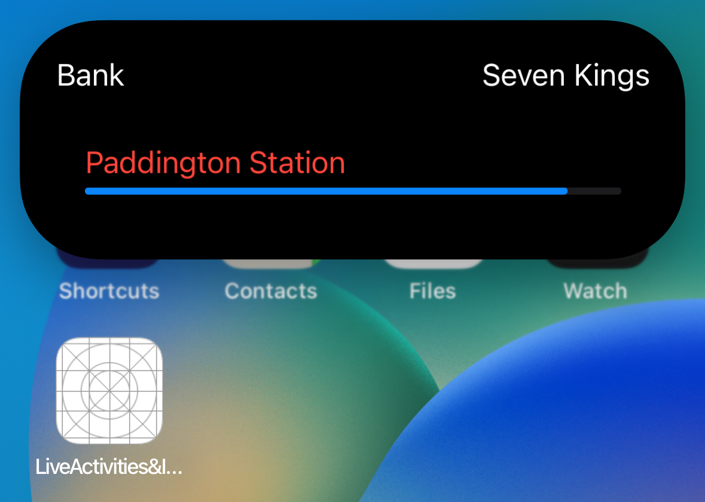

# iOS-16.1-ActivityKit-Dynamic-Island-Demo
Simple project to demonstrate how to use ActivityKit  &amp; Dynamic Island in iOS 16.1

## Overview

Live Activity & Dynamic Island are part of the ActivityKit API from Apple and Available on [`Xcode14.1`] and [`iOS16.1`]

